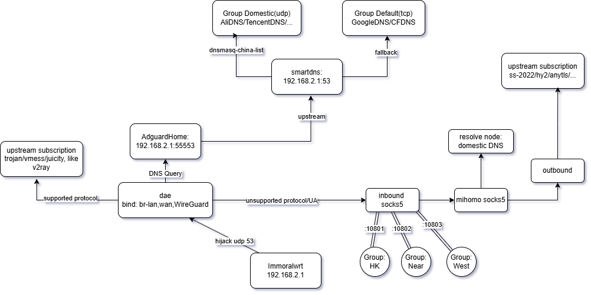

# 我没有很好的家庭网关设计方案

> 以下为旧设计, socks5的暴露容易出现udp timeout, 暂时没有找到原因

## 总体结构

dae作为代理的入口，接管dns流量。支持的协议或者利用UA能得到的协议走dae，不支持的协议走mihomo暴露的socks5.
DNS分流由smartdns结合dnsmasq-china-list负责，流量分流走dae，如此可以获得最快的直连速度。

## 一个组件做一件事

- 广告过滤: AdguardHome
- DNS增强与分流: smartdns
- DNS劫持与流量路由: dae
- 广泛协议支持: mihomo
